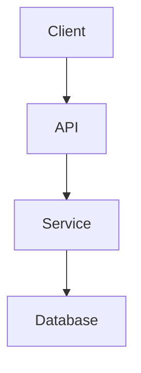

# MkDocs Quick Start Guide

## Installation

### Using pip

```bash
pip install -r requirements.txt
```

### Using conda

```bash
conda install mkdocs
pip install -r requirements.txt
```

## Development

### Serve Locally

Start the development server with live reload:

```bash
mkdocs serve
```

Open your browser at: `http://127.0.0.1:8000`

The server will automatically reload when you save changes to documentation files.

### Build Static Site

Generate the static HTML documentation:

```bash
mkdocs build
```

Output will be in the `site/` directory.

### Build with Strict Mode

Build and fail on any warnings:

```bash
mkdocs build --strict
```

## Multilingual Support

The project uses a **manual multilingual structure** with separate files:

```
docs/
├── index.md          # English (default)
├── index.en.md       # English (explicit)
└── index.pt-BR.md    # Portuguese (Brazil)
```

### Access Documentation

- **English:** `http://127.0.0.1:8000/` or `http://127.0.0.1:8000/index.en/`
- **Portuguese:** `http://127.0.0.1:8000/index.pt-BR/`

**Note:** Currently using manual file-based multilingual structure instead of the i18n plugin for simplicity.

## Project Structure

```
.
├── mkdocs.yml              # MkDocs configuration
├── requirements.txt        # Python dependencies
├── docs/
│   ├── index.md           # Main documentation page
│   ├── architecture/      # Architecture docs
│   ├── database/          # Database docs
│   ├── security/          # Security docs
│   ├── api/               # API documentation
│   ├── css/               # Custom styles
│   ├── js/                # Custom JavaScript
│   └── archive/           # Archived documents
└── site/                  # Generated static files (ignored by git)
```

## Writing Documentation

### Creating a New Page

1. Create a new `.md` file in the appropriate directory
2. Add the page to `mkdocs.yml` under the `nav` section

### Using Mermaid Diagrams

```markdown
## Architecture Diagram


````

Diagrams are clickable and open in a modal for better viewing.

### Using Admonitions

```markdown
!!! note
    This is a note admonition.

!!! warning
    This is a warning admonition.

!!! danger
    This is a danger admonition.

!!! success
    This is a success admonition.
```

### Code Blocks with Syntax Highlighting

````markdown
```kotlin
fun main() {
    println("Hello, World!")
}
```

```yaml
spring:
  application:
    name: customer-service
```
````

### Internal Links

```markdown
[Architecture Overview](architecture/overview.md)
[Database Configuration](database/overview.md)
```

## Deployment

### Deploy to GitHub Pages

```bash
mkdocs gh-deploy
```

### Deploy to Custom Server

1. Build the static site: `mkdocs build`
2. Copy the `site/` directory to your web server
3. Configure your web server to serve the static files

### Deploy via CI/CD

See the `.bitbucket-pipelines.yml` or `.github/workflows/` for automated deployment configuration.

## Testing

### Check Links

```bash
mkdocs build --strict
```

### Validate Configuration

```bash
mkdocs serve --strict
```

## Troubleshooting

### Port Already in Use

```bash
mkdocs serve -a 127.0.0.1:8001
```

### Plugin Not Found

```bash
pip install -r requirements.txt --force-reinstall
```

### Theme Not Loading

Check `mkdocs.yml` and ensure the theme is correctly specified:

```yaml
theme:
  name: bootstrap
```

### Mermaid Not Rendering

1. Check that the plugin is installed
2. Verify the mermaid2 plugin is in `mkdocs.yml`
3. Check browser console for JavaScript errors

## Commands Reference

| Command | Description |
|---------|-------------|
| `mkdocs serve` | Start development server |
| `mkdocs build` | Build static site |
| `mkdocs build --strict` | Build with warnings as errors |
| `mkdocs gh-deploy` | Deploy to GitHub Pages |
| `mkdocs new .` | Create new project |
| `mkdocs --version` | Show MkDocs version |

## Configuration

Key sections in `mkdocs.yml`:

- `site_name`: Project name
- `theme`: Theme configuration
- `plugins`: Enabled plugins
- `markdown_extensions`: Markdown features
- `nav`: Navigation structure
- `extra`: Additional configuration

## Resources

- [MkDocs Documentation](https://www.mkdocs.org/)
- [Bootstrap Theme](https://mkdocs.github.io/mkdocs-bootstrap/)
- [Mermaid Documentation](https://mermaid-js.github.io/)
- [PyMdown Extensions](https://facelessuser.github.io/pymdown-extensions/)

## Related Documentation

- [Project README](README.md)
- [CHANGELOG](CHANGELOG.md)
- [Architecture Documentation](docs/architecture/overview.md)

