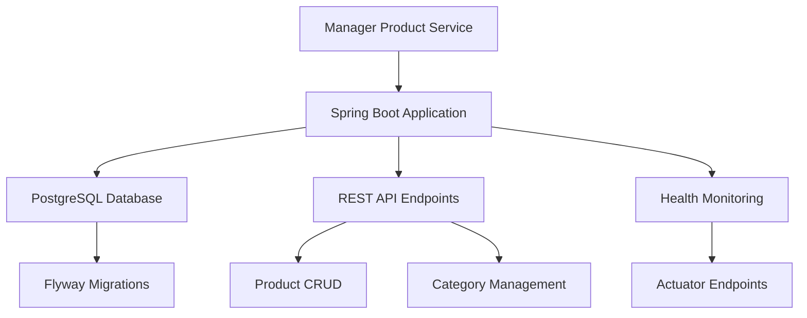

# Enhanced Features Test Page

This page demonstrates the enhanced documentation features implemented in task 1.

## Typography Hierarchy Test

# H1 Heading - Primary Color with Border
## H2 Heading - Secondary Color  
### H3 Heading - Standard Styling
#### H4 Heading - Regular Weight

Regular paragraph text with proper line height and Material Design typography.

## Callout Boxes Test

!!! tip "Success Callout"
    This is a tip callout with green styling and checkmark icon.

!!! warning "Warning Callout"
    This is a warning callout with orange styling and warning icon.

!!! danger "Error Callout"
    This is an error callout with red styling and X icon.

!!! note "Info Callout"
    This is an info callout with blue styling and lightbulb icon.

## Code Block Enhancement Test

```bash
# This code block should have:
# - Syntax highlighting
# - Copy button (on hover)
# - Language label
docker-compose up -d
./gradlew bootRun
```

```yaml
# YAML syntax highlighting test
spring:
  datasource:
    url: jdbc:postgresql://localhost:5432/db
    username: ${DATABASE_USERNAME}
    password: ${DATABASE_PASSWORD}
```

```kotlin
// Kotlin syntax highlighting test
@RestController
@RequestMapping("/api/products")
class ProductController(
    private val productService: ProductService
) {
    @GetMapping
    fun getAllProducts(): List<Product> {
        return productService.findAll()
    }
}
```

## Table Enhancement Test

| Component | Technology | Status | Environment |
|-----------|------------|--------|-------------|
| Database | PostgreSQL | <span class="status-badge required">Required</span> | <span class="env-tag dev">Dev</span> |
| Cache | Redis | <span class="status-badge optional">Optional</span> | <span class="env-tag staging">Staging</span> |
| Monitoring | Prometheus | <span class="status-badge recommended">Recommended</span> | <span class="env-tag prod">Prod</span> |

## Tabbed Content Test

=== "Development"
    Development environment configuration:
    
    ```properties
    DATABASE_HOST=localhost
    DATABASE_PORT=5432
    SPRING_PROFILES_ACTIVE=dev
    ```

=== "Staging"
    Staging environment configuration:
    
    ```properties
    DATABASE_HOST=staging-db.example.com
    DATABASE_PORT=5432
    SPRING_PROFILES_ACTIVE=staging
    ```

=== "Production"
    Production environment configuration:
    
    ```properties
    DATABASE_HOST=prod-db.example.com
    DATABASE_PORT=5432
    SPRING_PROFILES_ACTIVE=prod
    ```

## Grid Cards Test

<div class="grid cards" markdown>

-   :material-database:{ .lg .middle } **Database Setup**
    
    ---
    
    PostgreSQL configuration and setup guide
    
    [:octicons-arrow-right-24: Learn More](database/postgresql-setup.md)

-   :material-docker:{ .lg .middle } **Docker Configuration**
    
    ---
    
    Container setup and deployment
    
    [:octicons-arrow-right-24: Learn More](docker/containerization.md)

</div>

## Navigation Enhancements Test

### Breadcrumb Navigation
The breadcrumb navigation is automatically generated based on the page structure and current location.

### Cross-Reference Links Test

<div class="cross-reference">
  <div class="cross-reference-title">Related Topics</div>
  <div class="cross-reference-links">
    <a href="#code-block-enhancement-test" class="cross-reference-link">Code Block Features</a>
    <a href="#callout-boxes-test" class="cross-reference-link">Callout System</a>
    <a href="#table-enhancement-test" class="cross-reference-link">Table Styling</a>
  </div>
</div>

### Sticky Table of Contents
The table of contents on the right side should remain sticky during scrolling and highlight the current section.

### Mobile Responsive Design
Test the documentation on different screen sizes to verify:
- Touch-friendly button sizes (minimum 44px)
- Proper text scaling
- Horizontal scrolling for tables and code blocks
- Collapsible navigation on mobile devices

## Progress Indicator Test

<div class="progress-indicator">
  <div class="progress-step completed">1</div>
  <div class="progress-step active">2</div>
  <div class="progress-step">3</div>
  <div class="progress-step">4</div>
</div>

**Step 2 of 4**: Enhanced Documentation Structure Setup

## Mermaid Diagram Test



This test page validates all the enhanced features are working correctly.